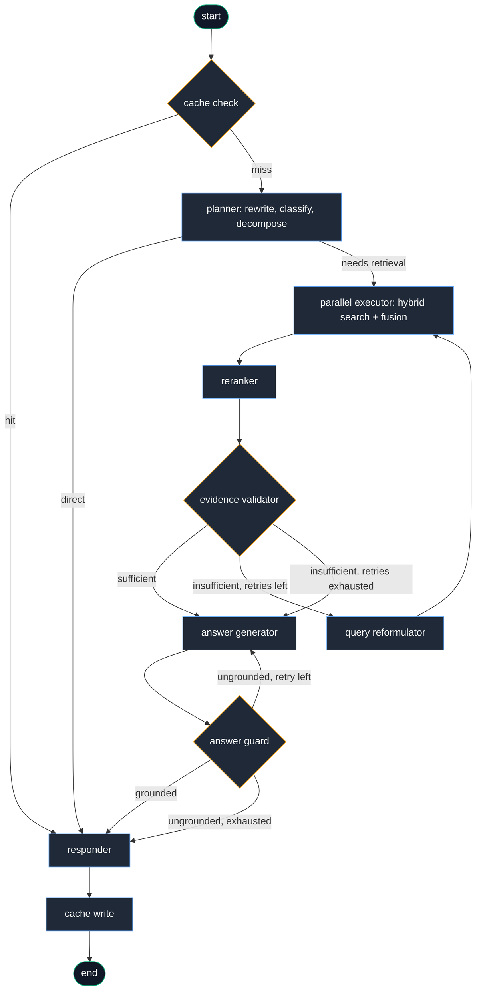

# SRKR Engineering College — AI Chatbot (RAG Pipeline)

An intelligent Retrieval-Augmented Generation (RAG) system designed to answer queries regarding SRKR Engineering College's academic curricula, departmental information, placement statistics, campus life, and administrative compliance documents.

---

## 📌 Project Status Overview

The project is actively built as an end-to-end RAG system powered by Python 3.12, **`uv`**, **LangChain**, **Jina AI Embeddings**, and **Qdrant Vector DB**.

### Current Implementation Milestones:
1. **Web Scraper**: Custom scraper using `requests`, `BeautifulSoup4`, and `markdownify` to harvest and convert website pages into clean `.md` files (`crawler/scrape_srkrec.py`).
2. **Raw Data Ingestion**:
   - **189 Scraped Markdown Web Pages** (`Data/raw/website/` or `Data/raw/*.md`).
   - **515 Academic & Administrative PDF Documents** (Syllabus R20/R23/R24, IQAC, BOS, NBA, NAAC, NIRF reports).
3. **Data Preprocessing & Cleaning**:
   - Custom noise reduction stripping navbars, footers, theme preseters, and empty image alt-text tags from Markdown.
   - Filtering cover pages and Model Question Paper (MQP) noise from syllabus PDFs.
   - Unicode sanitization for malformed PDF surrogate pairs (`safe_unicode`).
4. **Domain-Aware Chunking**:
   - Header-aware Markdown chunking with source URL context prepending.
   - Section/Course-unit aware PDF chunking with overlap windowing.
5. **Vector Embedding & Storage**:
   - **Embeddings**: `jina-embeddings-v5-text-small` (1024 dimensions) via `JinaEmbedder`.
   - **Vector Store**: Qdrant Cloud vector database with metadata payload indexing (`qdrant-client`).
6. **Generation / LLM Layer**:
   - Integrated with **Groq** (`llama-3.3-70b-versatile`) and **Google Gemini** (`gemini-embedding-001` / Gemini models) via `config.py`.

---

## 🧠 Agentic RAG Architecture

The query answering system operates as a self-reflective, adaptive decision graph built with **LangGraph**:



---

## 🏗️ Data Ingestion & Technology Stack

```
                                  ┌─────────────────────────────┐
                                  │      SRKR Web Pages         │
                                  └──────────────┬──────────────┘
                                                 │ Crawler (BeautifulSoup + Markdownify)
                                                 ▼
┌───────────────────────────┐     ┌─────────────────────────────┐
│  Academic / Admin PDFs    │     │   Scraped Markdown Files    │
│  (Syllabus, IQAC, BOS...) │     │   (Departments, Life...)    │
└─────────────┬─────────────┘     └──────────────┬──────────────┘
              │                                  │
              └─────────────────┬────────────────┘
                                │
                                ▼
                 ┌──────────────────────────────┐
                 │ Preprocessing & Cleaning     │
                 │ - Strip nav/footer noise     │
                 │ - Remove PDF cover pages     │
                 │ - Skip MQP exam questions    │
                 │ - Unicode sanitization       │
                 └──────────────┬───────────────┘
                                │
                                ▼
                 ┌──────────────────────────────┐
                 │ Domain-Aware Chunking        │
                 │ - MD: MarkdownHeaderSplitter │
                 │ - PDF: Course Unit / Overlap │
                 │ - Context Prepending         │
                 └──────────────┬───────────────┘
                                │
                                ▼
                 ┌──────────────────────────────┐
                 │ Embedding Pipeline           │
                 │ Jina Embeddings v5 (1024-d)  │
                 └──────────────┬───────────────┘
                                │
                                ▼
                 ┌──────────────────────────────┐
                 │ Vector Database              │
                 │ Qdrant Cloud Cluster         │
                 └──────────────┬───────────────┘
```

### Core Technologies
| Component | Tech Stack / Tool | Description |
| :--- | :--- | :--- |
| **Package Manager** | `uv` | High-performance Python project & dependency management |
| **Scraper** | `requests` + `bs4` + `markdownify` | Converts HTML web pages to Markdown |
| **Document Loaders** | `langchain-community` + `pypdf` | Custom MD & PDF loaders |
| **Embedding Model** | `Jina AI` (`jina-embeddings-v5-text-small`) | 1024-dim dense embeddings with task-aware prefixes |
| **Vector DB** | `Qdrant` (`qdrant-client`, `langchain-qdrant`) | Managed Qdrant Cloud cluster with HNSW indexing |
| **LLMs / Inference** | `Groq` (Llama-3.3-70B) & `Google Gemini` | High-throughput generation and fallback |

---

## 📚 Knowledge Base Taxonomy & Chunking Strategy

### 1. Website / Markdown Data
- **Scope**: Departments, Placements, Campus Life, Administration, Committees, College Statistics.
- **Challenges**: Every scraped file initially contained ~30% repetitive navbar/footer boilerplate, broken image tags (``), and isolated headers.
- **Strategy**:
  - Pre-clean boilerplate text before splitting (stripping nav links, copyright footers, theme preseters).
  - Prepend context tag `[Source: SRKR <Page Title>]` to every chunk text.
  - Retain structural headers (`MarkdownHeaderTextSplitter`) while folding numeric headers (`## 26`) into chunk bodies.

### 2. Syllabus PDFs (R20, R23, R24 Regulations)
- **Scope**: Course codes, course titles, L-T-P-C credits, objectives, course outcomes (COs), unit descriptions, textbooks.
- **Challenges**: Fixed character splitters cut across tables, page headers ("SAGI RAMA..."), and mixed exam paper questions (MQPs).
- **Strategy**:
  - Filter out Model Question Papers (`*mqp*.pdf`, `*model_paper*.pdf`).
  - Ignore repeated PDF cover pages (college header without course codes).
  - Use larger section windows (1500–2000 chars) with 200 overlap to keep course unit definitions intact.

### 3. Academic & Administrative Reports
- **Scope**: IQAC, NAAC, NBA, BOS, NIRF reports, meeting minutes.
- **Strategy**:
  - Use paragraph-based `RecursiveCharacterTextSplitter` (1200 chars, 200 overlap).
  - Inject PDF document title into payload metadata for precise filtering during retrieval.

---

## 📂 Project Directory Structure

```
chat_bot/
├── crawler/
│   └── scrape_srkrec.py        # Web crawler for harvesting SRKR website pages
├── Data/
│   ├── raw/                    # Unprocessed Markdown & PDF files
│   └── processeddata/          # Generated chunks.jsonl & embeddings.jsonl
├── Ingestion/
│   ├── chunking/               # Custom splitters & strategy handlers
│   │   ├── strategies/
│   │   │   ├── md_strategy.py  # Markdown chunking logic
│   │   │   └── pdf_strategy.py # PDF section-aware chunking logic
│   │   └── chunker.py          # Master chunker dispatch
│   ├── loaders/
│   │   ├── md_loader.py        # Custom Markdown loader
│   │   └── pdf_loader.py       # Custom PyPDF loader with unicode protection
│   ├── embedder.py             # Jina AI Embedding client (1024-dim)
│   ├── processor.py            # Preprocessing & noise reduction
│   └── pipeline.py             # Main execution script for full ingestion pipeline
├── config.py                   # Centralized settings & environment variables
├── pyproject.toml              # Project dependencies & package configuration
├── README.md                   # Project documentation & status
└── .env                        # Environment keys (Qdrant, Jina, Gemini, Groq)
```

---

## 🚀 Setup & Execution Guide

### Prerequisites
- **Python**: `>= 3.12`
- **uv**: `curl -LsSf https://astral.sh/uv/install.sh | sh`

### 1. Environment Configuration
Create a `.env` file in the root directory:

```env
# Qdrant Vector Store
QDRANT_CLUSTER_ENDPOINT=https://your-qdrant-cluster-url.qdrant.tech:6333
QDRANT_API_KEY=your_qdrant_api_key
QDRANT_COLLECTION_NAME=srkr_knowledge_base

# Jina Embeddings
JINA_API_KEY=jina_your_api_key

# LLM Providers
GEMINI_API_KEY=your_gemini_api_key
GROQ_API_KEY=your_groq_api_key
```

### 2. Install Dependencies
```bash
uv sync
```

### 3. Run Web Crawler (Optional)
To scrape or refresh raw web content:
```bash
uv run crawler/scrape_srkrec.py
```

### 4. Run the Full Ingestion Pipeline
To load raw data, clean boilerplate, chunk documents, generate embeddings, and upload to Qdrant:
```bash
uv run Ingestion/pipeline.py
```

---

## 📊 Ingestion Optimization Benchmarks

| Metric | Initial Pipeline | Optimized Pipeline |
| :--- | :--- | :--- |
| **Total Chunks** | ~25,956 | **~8,000 – 12,000** |
| **Boilerplate Noise** | High (Navbars, Footers, Covers) | **Zero (Stripped)** |
| **Embedding API Cost / Requests** | ~811 batches | **~250 – 375 batches** |
| **Syllabus Granularity** | Broken across tables | **Preserved per Course / Unit** |
| **Retrieval Accuracy** | Noise pollution | **High Precision Context** |

---


## 🔮 Roadmap & Observability

- [x] **Hybrid Search**: Integrate BM25 sparse keyword search alongside dense Qdrant vector retrieval.
- [x] **Re-ranking**: Implement Jina Reranker v2 to re-rank top-K retrieved candidates before LLM context construction.
- [x] **Observability**: Added **LangSmith** tracing across LangGraph nodes, sub-queries, BM25, RRF fusion, reranker, and LLM providers.
- [ ] **Interactive UI**: Build a lightweight Next.js / Streamlit web interface for student queries.

### 🔍 Enabling LangSmith Tracing

To enable end-to-end tracing and monitoring in LangSmith, add the following variables to your `.env` file:

```bash
LANGSMITH_TRACING=true
LANGSMITH_API_KEY=lsv2_pt_...
LANGSMITH_PROJECT=srkr-academic-advisor
# Optional:
LANGSMITH_ENDPOINT=https://api.smith.langchain.com
```