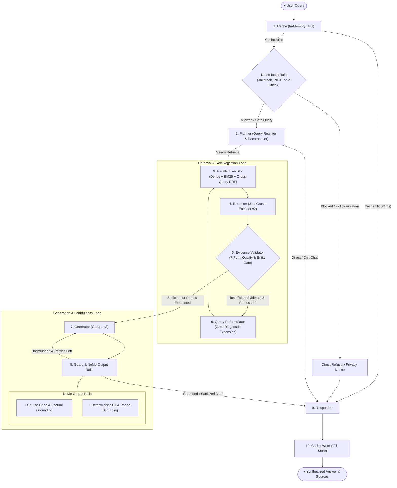

# CLG Chatbot

> A production-grade, self-reflective Agentic RAG assistant for academic institutions, built with **LangGraph**, **NeMo Guardrails**, **Hybrid Retrieval (Dense + BM25 + RRF)**, and **Cross-Encoder Reranking**.

---

## 🚀 Key Features Implemented

1. **Hybrid Retrieval (Dense + BM25 + RRF)**: Combines semantic vector search (Jina Embeddings in Qdrant) with keyword search (BM25) and merges the top results using Reciprocal Rank Fusion (RRF) for high-accuracy document retrieval.
2. **Self-Reflective Agentic Workflow (LangGraph)**: An autonomous state graph that classifies user queries, routes chit-chat directly, breaks complex questions into sub-queries, and automatically reformulates search queries if initial evidence is lacking.
3. **NeMo Guardrails & Safety**: Enforces input rails to block prompt injections and off-topic questions, output rails to stop hallucinated course codes, and deterministic PII scrubbing to protect private contact numbers.
4. **Cross-Encoder Precision Reranking**: Re-evaluates retrieved document chunks with Jina Reranker v2 using deep cross-attention, filtering down to the highest-quality chunks before generating answers.
5. **7-Point Evidence Validation Gate**: Verifies retrieved context quality before answering—checking score confidence, pruning redundant text, ensuring sub-query coverage, and verifying target entities (faculty names, HODs, course codes).
6. **Full-Stack Chat Application**: A FastAPI backend supporting Server-Sent Events (SSE) for real-time streaming, paired with a modern Next.js 16 chat interface and automated multi-key failover across Groq and Gemini models.

---

## 🧠 System Architecture



---

## 📂 Project Structure

```
chat_bot/
├── agent/                      # LangGraph autonomous multi-agent pipeline
│   ├── graph.py                # Graph compilation, conditional edges & state transitions
│   ├── state.py                # AgentState schema and type definitions
│   └── nodes/                  # Modular state graph execution nodes
│       ├── cache.py            # In-memory query caching node
│       ├── planner.py          # Query analysis, input rails, and sub-query generation
│       ├── executor.py         # Parallel hybrid retrieval (dense + BM25 + RRF)
│       ├── reranker.py         # Jina Cross-Encoder precision reranker
│       ├── validator.py        # 7-point quality and entity verification gate
│       ├── reformulator.py     # Diagnostic query expansion for retries
│       ├── generator.py        # Factual, grounded answer generation
│       ├── guard.py            # Output rail validation and PII sanitization
│       └── responder.py        # Output formatting, citations, and response delivery
├── app/                        # Shared business logic and backend services
│   ├── models.py               # Data models (RetrievedChunk, ChatMessage, etc.)
│   ├── ingestion/              # Ingestion pipeline, chunking, and loaders
│   └── services/               # Core AI services
│       ├── retrieval/          # Jina embedder, BM25, RRF fusion, and Qdrant retriever
│       └── generation/         # LLM inference adapters and prompt templates
├── backend/                    # FastAPI web server
│   ├── run.py                  # Server entrypoint script
│   └── app/
│       ├── main.py             # FastAPI application and CORS configuration
│       ├── api/                # REST and Server-Sent Events (SSE) chat endpoints
│       └── core/               # API configuration and settings
├── frontend/                   # Next.js 16 web application
│   ├── src/                    # UI components, ChatWidget, and layout
│   └── package.json            # React 19 and Tailwind CSS dependencies
├── guardrails/                 # NeMo Guardrails configuration & custom actions
│   ├── config/                 # Colang flows, rails, and prompts
│   ├── actions.py              # Grounding verification and PII scrubbing actions
│   └── service.py              # NeMo Guardrails runtime service
├── crawler/                    # Web scrapers for harvesting college portal pages
├── config.py                   # Centralized configuration loader with key failover
├── .env.example                # Template for environment variables
└── pyproject.toml              # Python project configuration (managed via uv)
```

---

## 🛠️ How to Use This

### Prerequisites

- **Python**: `>= 3.12`
- **Node.js**: `>= 18.0` (for frontend)
- **uv**: Fast Python package installer (`curl -LsSf https://astral.sh/uv/install.sh | sh`)

---

### 1. Environment Setup

Copy the example environment template and configure your API credentials:

```bash
cp .env.example .env
```

Open `.env` and supply your API keys:
- **Groq API Key**: LLM inference for Planner, Reformulator, and Generator.
- **Qdrant Endpoint & API Key**: Vector storage and hybrid candidate search.
- **Jina API Key**: Embeddings (`jina-embeddings-v5-text-small`) and Cross-Encoder reranking (`jina-reranker-v2-base-multilingual`).
- **LangSmith Key** *(Optional)*: Tracing and observability.

---

### 2. Install Dependencies

Install all Python dependencies using `uv`:

```bash
uv sync
```

---

### 3. Run the Backend API

Start the FastAPI application:

```bash
uv run python backend/run.py
```

The API server will launch at `http://localhost:8000`:
- **Interactive Swagger Docs**: `http://localhost:8000/api/docs`
- **Health Check**: `http://localhost:8000/api/health`
- **SSE Streaming Chat Endpoint**: `POST http://localhost:8000/api/chat`

---

### 4. Run the Frontend UI

In a separate terminal, install dependencies and launch the Next.js dev server:

```bash
cd frontend
npm install
npm run dev
```

Open `http://localhost:3000` in your browser to interact with the chatbot interface.

---

### 5. Optional: Data Ingestion & Crawling

To crawl new pages or re-ingest raw documents into Qdrant:

```bash
# Run crawler to update raw markdown files
uv run crawler/scrape_srkrec.py

# Run ingestion pipeline (chunking, embedding, Qdrant indexing)
uv run Ingestion/pipeline.py
```